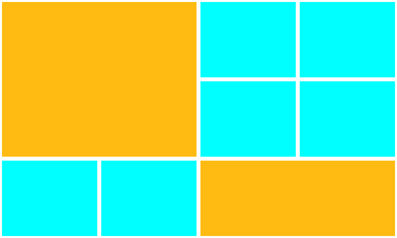
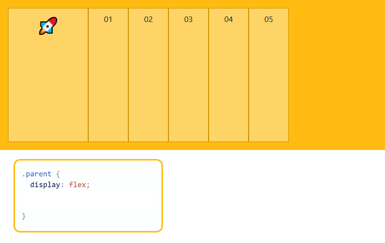

# CSS Layout
Dans ce module, on va commencer à créer des mises en pages qui permettent de mettre des éléments les uns a cotés des autres.


## Élément block vs élément inline
### Block
Les éléments de type _block_ sont les balises qui servent généralement à grouper plusieurs balise à l’intérieur tel que les `div`, `header`, `footer`, `main`, `li`, `section`, …
Leur particularité principale au niveau du CSS est de prendre toute la largeur par défaut, même si le contenu est composé d'un seul mot.
Ils peuvent contenir n’importe quelle balise valide _block_ ou _inline_
### Inline
La largeur des éléments _inline_ est égale à la taille de son contenu. On peut les styler en css mais les propriétés `width`, `height`, `padding-top`, `padding-bottom`, `margin-top`, `margin-bottom` sont ignorés.
Deux éléments `inline` qui se suivent dans le HTML seront côte à côte dans le rendu visuelle de la page
 [Liste des éléments block et inline](https://www.w3schools.com/html/html_blocks.asp)

### Comment convertir un élément inline en block, vise et versa ?
Pour pouvoir profiter de toutes les propriétés CSS d’un élément block sur un élément inline, il va falloir changer son `display`. La propriété CSS `display` permet de dire au navigateur comment l’élément doit se comporter.

#### Pourquoi je n’ai pas mis `display: inline` sur la div orange ?
La valeur `inline-block` permet de faire un mix des deux : ne pas insérer une nouvelle ligne et pouvoir utiliser les propriétés ignorées en mode inline (`width`, `height`, `padding-top`, `padding-bottom`, `margin-top`, `margin-bottom` )

[La liste des valeurs disponibles de `display`](https://developer.mozilla.org/fr/docs/Web/CSS/display). Dans ce TP, on va se contenter des valeurs `grid` et `flex`.

## Un peu de design pour comprendre la mise en page
### La grille
En design, la grille est l’un des outils les plus utilisés. Elle permet de créer une structure de mise en page qui permet de placer et d’aligner parfaitement les éléments du contenu.



### La gouttière
La gouttière, c’est le nom qu’on utilise pour désigner l’espace qui sépare les colonnes.

## Comment créer une grille en CSS ?
Tout passe par la propriété `display`. Après des années de traversé du désert et de hack pour juste créer 3 colonnes et 2 gouttières, vous aller pouvoir mettre en page rapidement avec CSS grid.

Grid est un module CSS très dense parce qu’il a été pensé et mis à jour pour pouvoir faire des mises en page avancées. Dans ce TP, on va se contenter du strict minimum pour pouvoir répondre au besoin le plus courant : aligner des éléments les un à côtés des autres.

### Fonctionnement de CSS Grid
1. On déclare une grille
2. On déclare la taille des gouttières
3. On définit le nombre de colonnes que contient la grille

Pour définir la taille des colonnes, on peut soit utiliser une valeur connue comme `240px`, `25rem`, `5vw`, …

````CSS
.parent {
  display: grid;
  gap: 1rem;
  grid-template-columns: 22.5rem 22.5rem 22.5rem 22.5rem;
}
````

Ici, j’ai défini une grille de 4 colonnes de 22.5rem avec des gouttière de `1rem`.

#### L’unité spécifique pour créer une grille : `fr`
`fr` veut dire fraction. C’est l’unité la plus intéressante parce que qu’on a plus de calcul à faire par rapport à la taille de l’écran. C’est le navigateur qui va créer les colonnes en fonction du nombre de `fr` qu’on a déclaré.
`1fr` veut dire que les éléments de la grille vont occuper une fraction de la place disponible.


#### `repeat()` à la rescousse
Bon, écrire x fois `1fr`, ça peut vite devenir pénible. C’est pourquoi est sorti l’outil `repeat()`. Il permet de spécifier :
Combien de colonne on souhaite
Quelle est leurs tailles

````CSS
.parent {
  display: grid;
  gap: 1rem;
  grid-template-columns: repeat(4, 1fr);
}
````

Ici, je demande une grille de 4 colonne qui occupent une fraction de la place disponible.

#### Un grille responsive avec 1 ligne de code et sans media-queries ? WHAT ?!
##### Auto-fit et minmax
Voilà une grille parfaitement responsive sans aucune media querie.

````CSS
.parent {
  display: grid;
  gap: 1rem;
  grid-template-columns: repeat(auto-fit, minmax(320px, 1fr));
}
````

Décodons un peu. Puisque nous concevons des interfaces qui doivent s’adapter en fonction de la place disponible, définir un nombre de colonnes n’est pas une stratégie optimisée. En effet, il va falloir redéfinir la grille au fur et à mesure que la taille de l’écran s’agrandit via des média-queries.

Donc la solution la plus élégante consiste à dire au navigateur :
> Cher navigateur, je veux une grille où les éléments font minimum 320px et maximum 1fr (minmax). Si tu as la place, ajoutes des colonnes, sinon rempli l’espace disponible (auto-fit).

Magique non ?

## CSS Flexbox
Flexbox est un modèle de mise en page à 2 sens : vertical et horizontal. Il est aussi très complet donc on se contentera ici aussi du minimum à savoir.

### Pourquoi CSS grid ET flexbox ?
C’est une bonne question, merci de la poser. Chacun a été créer pour une utilisation spécifique. On va utiliser grid pour créer une grille sur laquelle on va faire rentrer des éléments. Pour flexbox, le but est de laisser le contenu s’agencer lui-même tout en étant très précis sur la façon de s’aligner, de s’agrandir ou de se rétrécir.

Pour résumer, si vous avez l’interface de Netflix à recréer, CSS Grid sera plus adapté pour faire la grille du catalogue. Pour les cartes avec la miniature, flexbox sera plus adapté pour faire le job.

### Revenons à flexbox
Il se déclare comme ça
````CSS
.parent {
  display: flex;
}
````
Dès que vous avez déclaré ça, le navigateur va placer tous les éléments sur la même ligne, quitte à placer une barre de scroll horizontal. Par défaut, le navigateur ne s’autorise pas à aller à la ligne. Si besoin, on peut lui donner la permission.
````CSS
.parent {
  display: flex;
  flex-wrap: wrap;
}
````

### Flex comme… flexible
Avec flexbox, on peut définir une taille et aussi dire comment le navigateur doit s’adapter quand il manque de place ou s’il en a trop.


- `flex-basis` remplace width.
- `flex-shrink` définie comment l’élément doit rétrécir s’il manque de place.
- `flex-grow` définie comment l’élément doit s’agrandir s’il y a un surplus de place.

Pour `flex-shrink` et `flex-grow`, plus la valeur est importante, plus le navigateur donnera la priorité à l’élément pour s’agrandir ou se rétrécir selon le contexte.


### L’alignement des éléments

On peut gérer l’alignement des éléments avec
`justify-content` : Gère l’alignement sur axe principal
`align-items` : Gère l’alignement sur l’axe secondaire
`margin-top` et `margin-bottom` sur les enfants pour l’axe vertical



#### Axe principal et secondaire
L’axe principal est définie par `flex-direction`. Sa valeur par défaut (`row`) définie l’axe principal à l’horizontal. Donc l’axe secondaire est l’axe vertical
Par contre, si je change `flex-direction` en `column`, cela s’inverse. L’axe principal devient l’axe vertical.

#### Astuce et simplification
Pour l’alignement vertical, il vaut mieux privilégier la solution `margin` sur les enfants. Comme ça vous n’avez plus qu’à gérer l’axe horizontal.

### Changer de direction
Comme je l’ai dit dans l’intro, _flexbox_ gère aussi bien le sens vertical qu’horizontal. Grâce à `flex-direction`, on peut passer en mode “colonne”


Vous remarquez qu’avec la valeur `column`, c’est la même chose que lorsque l’élément n’était pas en `display: flex`. Donc quel intérêt ?

L’intérêt principal, c’est que maintenant qu’on a un élément flexible. On va pouvoir profiter de la puissance d’alignement vu au-dessus. Le contenu n’a pas toujours la même hauteur.
Prenons un exemple concret. Ici, j’ai une grille où les enfants ne sont pas en `display:flex`


Vous voyez le soucis ? Les boutons ne sont pas alignés. Grâce à flexbox, on va placer le bouton en bas de la carte, quelle que soit la longueur du contenu.


## Travaux pratiques
➡ [Accéder aux challenges](./tp03.zip) (clic droit -> enregistrez-sous.)
